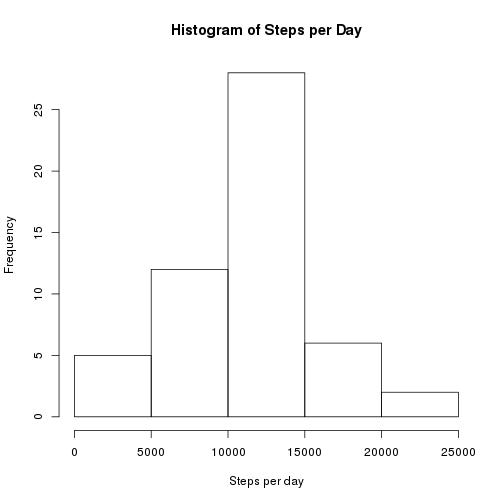
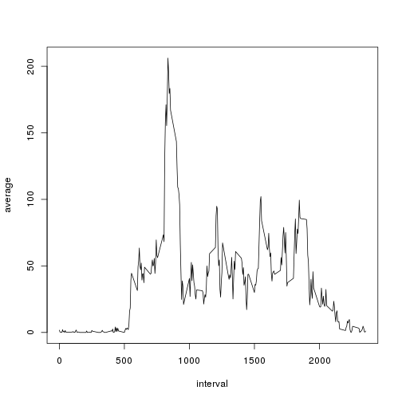
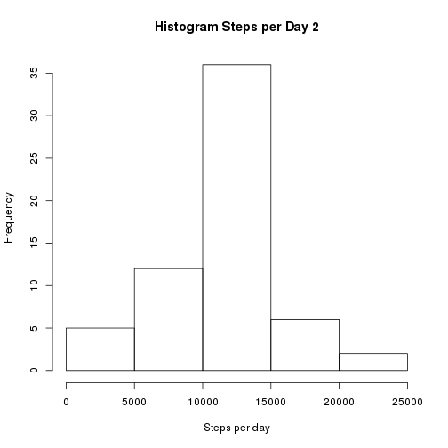
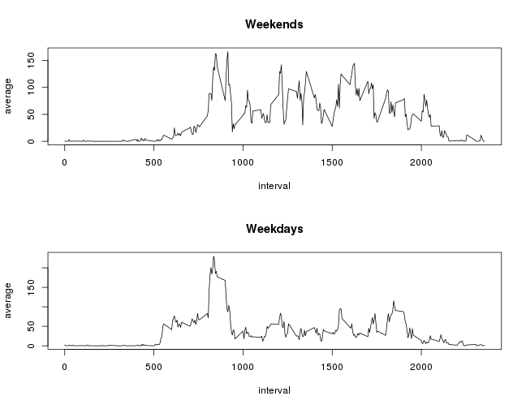

Be sure all R code is going to be visible.


```r
opts_chunk$set(echo=TRUE)
```

## Loading and preprocessing the data

I load data into variable `d`.


```r
library(dplyr)

d <- read.csv(unz('activity.zip', 'activity.csv'))
d$date <- as.Date(as.character(d$date, "%Y-%m-%d"))
d <- tbl_df(d)
```

## What is mean total number of steps taken per day?

First, calculate the total number of steps taken per day.


```r
grouped_by_day <- group_by(filter(d, !is.na(steps)), date)
steps_per_day <- summarise(select(grouped_by_day, date, steps),
                           total=sum(steps))
```

Then, make an histogram of the total number of steps taken each day.


```r
hist(steps_per_day$total,
     xlab="Steps per day",
     main="Histogram of Steps per Day")
```

 

Last, calculate the mean and median of the total number of steps taken per
day.


```r
mean(steps_per_day$total)
```

```
## [1] 10766.19
```

```r
median(steps_per_day$total)
```

```
## [1] 10765
```

## What is the average daily activity pattern?


```r
by_interval <- group_by(filter(d, !is.na(steps)), interval)
by_interval <- summarise(select(by_interval, interval, steps),
                         average=mean(steps))
with(by_interval, plot(interval, average, type="l"))
```

 

Which 5-minute interval contains the maximum number of steps?


```r
filter(by_interval, average == max(average))
```

```
## Source: local data frame [1 x 2]
## 
##   interval  average
## 1      835 206.1698
```

That is, 08:35.

## Imputing missing values

There is 2304 rows with NAs. That's about 13%.


```r
sum(is.na(d))
```

```
## [1] 2304
```

```r
sum(is.na(d)) / nrow(d) * 100
```

```
## [1] 13.11475
```

The simplest and quickest strategy for filling the missing values I can think
of is : Reusing the mean calculated earlier for each 5-minute interval.
Here it is:


```r
# Using a for loop to build the second dataset. I'm sure one can do this using
# a vectorized function but I don't know how to, do you?
d2 <- d
for(i in 1:nrow(d2)) {
    if(is.na(d2$steps[i])) {
        d2$steps[i] <- by_interval[by_interval$interval == d2$interval[i], ]$average
  }
}
```

Here is the histogram with the new dataset:


```r
grouped_by_day2 <- group_by(d2, date)
steps_per_day2 <- summarise(select(grouped_by_day2, date, steps),
                            total=sum(steps))
hist(steps_per_day2$total,
     main="Histogram Steps per Day 2",
     xlab="Steps per day")
```

 

And here is the mean and the median with the new dataset:


```r
mean(steps_per_day2$total)
```

```
## [1] 10766.19
```

```r
median(steps_per_day2$total)
```

```
## [1] 10766.19
```

As you can see, the impact of imputing missing data with the mean for each
5-minute interval is visible, but not that big.

## Are there differences in activity patterns between weekdays and weekends?

Create a new factor variable with `weekday` and `weekend`.

But first, force the locale time to be in english.


```r
locale_saved <- Sys.getlocale("LC_TIME")
Sys.setlocale("LC_TIME", "C")
```

```
## [1] "C"
```

```r
d2$daytype <- weekdays(d2$date)
d2$daytype <- sapply(d2$daytype,
                     function(x) {
                         if(x %in% c('Saturday', 'Sunday')) {
                             'weekend'
                         } else {
                             'weekday'
                         }})
d2$daytype <- as.factor(d2$daytype)
```

Plot a time series for «weekdays» and another one for «weekends». We can see
some differences between the two of them.


```r
# Using %>% operator to — hopefuly — be clearer.

weekdays <- d2 %>%
            filter(daytype == 'weekday') %>%
            group_by(interval) %>%
            select(interval, steps) %>%
            summarise(average=mean(steps))

weekends <- d2 %>%
            filter(daytype == 'weekend') %>%
            group_by(interval) %>%
            select(interval, steps) %>%
            summarise(average=mean(steps))

par(mfrow=c(2,1))
plot(weekends, type="l", main='Weekends')
plot(weekdays, type="l", main='Weekdays')
```

 

Last, restore the locale time.


```r
Sys.setlocale("LC_TIME", locale_saved)
```

```
## [1] "C"
```
